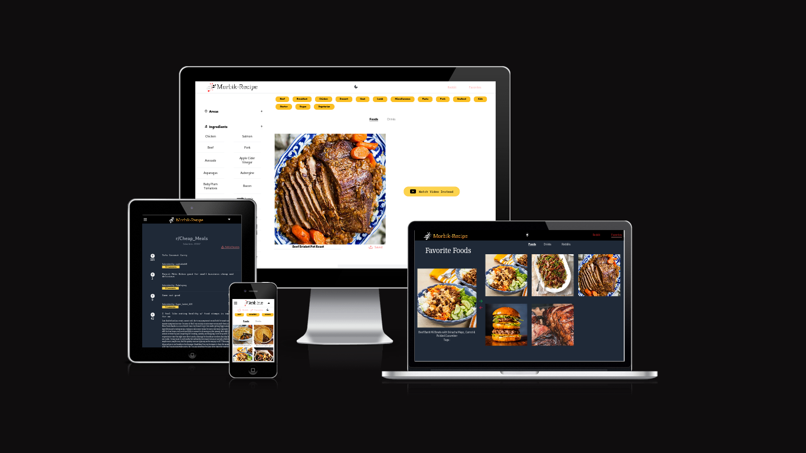

# Morbik Recipe

This project utilized TheMealDB and CocktailDB APIs to show different recipes from around the world. The exercises can be filtered in different categories. It also suggests d/t subreddits that are mainly about food or cocktails.

    Has a dark mode functionality and user can also save their favorite recipes and subreddits. The site is fully responsive. 

 
    

    This is a MERN stack project and that also uses tailwind for styling.
 

### Built using
<code>#reactjs #tailwind #redditapi #themealdb api #thecocktaildb api #netlify </code>

 
 

## Project Screenshots

 
 

<table>
    <tr>
        <td >
          
        </td>
        <td>
          
        </td>
    </tr>
     <tr>
        <td>
          
        </td>
        <td>
          
        </td>
    </tr>
    <tr>
        <td>
          
        </td>
    </tr>
</table>
 

 

<a href="https://morbikrecipe.netlify.app/" > Go to project </a>

